# 📚 DOCUMENTAÇÃO TÉCNICA - PORTAL NIMOENERGIA
## DICIONÁRIO DE DADOS E ESPECIFICAÇÕES

---

## 📋 DICIONÁRIO DE DADOS

### 🏢 TABELA: TRANSPORTADORAS
| Campo | Tipo | Tamanho | Nulo | Chave | Descrição |
|-------|------|---------|------|-------|-----------|
| id_transportadora | INT | - | NÃO | PK | Identificador único da transportadora |
| cnpj | VARCHAR | 18 | NÃO | UK | CNPJ da empresa (formato: 00.000.000/0000-00) |
| razao_social | VARCHAR | 255 | NÃO | - | Razão social da empresa |
| nome_fantasia | VARCHAR | 255 | SIM | - | Nome fantasia da empresa |
| cep | VARCHAR | 9 | SIM | - | CEP do endereço (formato: 00000-000) |
| endereco | VARCHAR | 255 | SIM | - | Logradouro completo |
| numero | VARCHAR | 20 | SIM | - | Número do endereço |
| complemento | VARCHAR | 100 | SIM | - | Complemento do endereço |
| bairro | VARCHAR | 100 | SIM | - | Bairro |
| cidade | VARCHAR | 100 | SIM | - | Cidade |
| estado | VARCHAR | 2 | SIM | - | UF do estado |
| telefone | VARCHAR | 20 | SIM | - | Telefone de contato |
| email | VARCHAR | 255 | SIM | - | Email de contato |
| status | ENUM | - | NÃO | - | Status: ATIVA, INATIVA, PENDENTE, SUSPENSA |
| taxa_conformidade | DECIMAL | 5,2 | NÃO | - | Taxa de conformidade (0.00 a 100.00) |
| ultima_atualizacao | DATE | - | SIM | - | Data da última atualização de documentos |
| created_at | TIMESTAMP | - | NÃO | - | Data de criação do registro |
| updated_at | TIMESTAMP | - | NÃO | - | Data da última atualização |

### 👥 TABELA: USUARIOS
| Campo | Tipo | Tamanho | Nulo | Chave | Descrição |
|-------|------|---------|------|-------|-----------|
| id_usuario | INT | - | NÃO | PK | Identificador único do usuário |
| email | VARCHAR | 255 | NÃO | UK | Email de login (único) |
| senha_hash | VARCHAR | 255 | NÃO | - | Hash da senha (bcrypt) |
| nome | VARCHAR | 255 | NÃO | - | Nome completo do usuário |
| tipo | ENUM | - | NÃO | - | Tipo: ADMIN, TRANSPORTADORA |
| id_transportadora | INT | - | SIM | FK | ID da transportadora (apenas para tipo TRANSPORTADORA) |
| status | ENUM | - | NÃO | - | Status: ATIVO, INATIVO, BLOQUEADO |
| ultimo_acesso | TIMESTAMP | - | SIM | - | Data/hora do último acesso |
| tentativas_login | INT | - | NÃO | - | Contador de tentativas de login falhadas |
| created_at | TIMESTAMP | - | NÃO | - | Data de criação do registro |
| updated_at | TIMESTAMP | - | NÃO | - | Data da última atualização |

### 📄 TABELA: TIPOS_DOCUMENTO
| Campo | Tipo | Tamanho | Nulo | Chave | Descrição |
|-------|------|---------|------|-------|-----------|
| id_tipo | INT | - | NÃO | PK | Identificador único do tipo |
| nome | VARCHAR | 100 | NÃO | UK | Nome do tipo de documento |
| descricao | TEXT | - | SIM | - | Descrição detalhada |
| categoria | ENUM | - | NÃO | - | Categoria: SOCIETARIO, SEGURO, AMBIENTAL, OUTROS |
| requer_vencimento | BOOLEAN | - | NÃO | - | Se requer data de vencimento |
| requer_garantia | BOOLEAN | - | NÃO | - | Se requer valor de garantia |
| status | ENUM | - | NÃO | - | Status: ATIVO, INATIVO |
| created_at | TIMESTAMP | - | NÃO | - | Data de criação do registro |
| updated_at | TIMESTAMP | - | NÃO | - | Data da última atualização |

### 📋 TABELA: DOCUMENTOS
| Campo | Tipo | Tamanho | Nulo | Chave | Descrição |
|-------|------|---------|------|-------|-----------|
| id_documento | INT | - | NÃO | PK | Identificador único do documento |
| id_transportadora | INT | - | NÃO | FK | ID da transportadora proprietária |
| id_tipo | INT | - | NÃO | FK | ID do tipo de documento |
| nome_arquivo | VARCHAR | 255 | NÃO | - | Nome original do arquivo |
| arquivo_path | VARCHAR | 500 | NÃO | - | Caminho do arquivo no servidor |
| tamanho_arquivo | BIGINT | - | SIM | - | Tamanho do arquivo em bytes |
| tipo_mime | VARCHAR | 100 | SIM | - | Tipo MIME do arquivo |
| data_upload | TIMESTAMP | - | NÃO | - | Data/hora do upload |
| data_vencimento | DATE | - | SIM | - | Data de vencimento (se aplicável) |
| valor_garantia | DECIMAL | 15,2 | SIM | - | Valor da garantia (para seguros) |
| status | ENUM | - | NÃO | - | Status: PENDENTE, APROVADO, REJEITADO, VENCIDO, VENCENDO |
| observacoes | TEXT | - | SIM | - | Observações sobre o documento |
| created_at | TIMESTAMP | - | NÃO | - | Data de criação do registro |
| updated_at | TIMESTAMP | - | NÃO | - | Data da última atualização |

### 👨‍💼 TABELA: SOCIOS
| Campo | Tipo | Tamanho | Nulo | Chave | Descrição |
|-------|------|---------|------|-------|-----------|
| id_socio | INT | - | NÃO | PK | Identificador único do sócio |
| id_transportadora | INT | - | NÃO | FK | ID da transportadora |
| nome | VARCHAR | 255 | NÃO | - | Nome completo do sócio |
| cpf | VARCHAR | 14 | NÃO | - | CPF do sócio (formato: 000.000.000-00) |
| rg | VARCHAR | 20 | SIM | - | RG do sócio |
| funcao | VARCHAR | 100 | SIM | - | Função na empresa |
| status | ENUM | - | NÃO | - | Status: ATIVO, INATIVO |
| created_at | TIMESTAMP | - | NÃO | - | Data de criação do registro |
| updated_at | TIMESTAMP | - | NÃO | - | Data da última atualização |

### ✅ TABELA: APROVACOES
| Campo | Tipo | Tamanho | Nulo | Chave | Descrição |
|-------|------|---------|------|-------|-----------|
| id_aprovacao | INT | - | NÃO | PK | Identificador único da aprovação |
| id_documento | INT | - | NÃO | FK | ID do documento aprovado/rejeitado |
| id_usuario | INT | - | NÃO | FK | ID do usuário que fez a ação |
| acao | ENUM | - | NÃO | - | Ação: APROVADO, REJEITADO, SOLICITADO_CORRECAO |
| status_anterior | ENUM | - | SIM | - | Status anterior do documento |
| status_novo | ENUM | - | SIM | - | Novo status do documento |
| observacoes | TEXT | - | SIM | - | Observações da aprovação/rejeição |
| data_acao | TIMESTAMP | - | NÃO | - | Data/hora da ação |

### 🔗 TABELA: USUARIO_TRANSPORTADORA
| Campo | Tipo | Tamanho | Nulo | Chave | Descrição |
|-------|------|---------|------|-------|-----------|
| id_relacao | INT | - | NÃO | PK | Identificador único da relação |
| id_usuario | INT | - | NÃO | FK | ID do usuário (admin) |
| id_transportadora | INT | - | NÃO | FK | ID da transportadora |
| permissao | ENUM | - | NÃO | - | Permissão: LEITURA, ESCRITA, ADMIN |
| created_at | TIMESTAMP | - | NÃO | - | Data de criação da relação |

---

## 🔐 ESPECIFICAÇÕES DE AUTENTICAÇÃO

### **FLUXO DE LOGIN UNIFICADO:**

```mermaid
graph TD
    A[Usuário acessa portal] --> B[Tela de login única]
    B --> C[Insere email/senha]
    C --> D[Sistema valida credenciais]
    D --> E{Tipo de usuário?}
    E -->|ADMIN| F[Dashboard NIMOENERGIA]
    E -->|TRANSPORTADORA| G[Dashboard Transportadora]
    F --> H[Acesso completo ao sistema]
    G --> I[Acesso restrito aos próprios dados]
```



### **REGRAS DE AUTENTICAÇÃO:**

1. **Login único:** Apenas um formulário de login
2. **Identificação automática:** Sistema identifica o tipo pelo campo `usuarios.tipo`
3. **Redirecionamento inteligente:** 
   - `ADMIN` → Dashboard administrativo completo
   - `TRANSPORTADORA` → Dashboard específico da transportadora
4. **Sessão segura:** Token JWT com expiração
5. **Controle de tentativas:** Bloqueio após 5 tentativas falhadas

### **PERMISSÕES POR TIPO:**

#### **ADMIN (NIMOENERGIA):**
- ✅ Visualizar todas as transportadoras
- ✅ Aprovar/rejeitar documentos
- ✅ Acessar relatórios e métricas
- ✅ Gerenciar usuários
- ✅ Configurações do sistema

#### **TRANSPORTADORA:**
- ✅ Visualizar apenas próprios dados
- ✅ Upload de documentos
- ✅ Visualizar status de aprovação
- ✅ Atualizar dados cadastrais
- ❌ Não acessa outras transportadoras
- ❌ Não aprova documentos

---

## 📊 MÉTRICAS E INDICADORES

### **KPIs PRINCIPAIS:**
1. **Taxa de Conformidade:** Percentual de documentos aprovados por transportadora
2. **Documentos Vencendo:** Documentos que vencem nos próximos 30 dias
3. **Tempo Médio de Aprovação:** Tempo entre upload e aprovação
4. **Transportadoras Ativas:** Número de transportadoras com status ATIVA

### **ALERTAS AUTOMÁTICOS:**
1. **Vencimento:** Documentos vencendo em 30, 15 e 7 dias
2. **Conformidade:** Taxa abaixo de 80%
3. **Pendências:** Documentos pendentes há mais de 5 dias
4. **Documentos Vencidos:** Documentos com vencimento ultrapassado

---

## 🔧 MANUTENÇÃO E ROTINAS

### **ROTINAS DIÁRIAS:**
- Execução da procedure `VerificarVencimentos()`
- Atualização de taxas de conformidade
- Limpeza de logs antigos

### **ROTINAS SEMANAIS:**
- Backup completo do banco
- Análise de performance das queries
- Relatório de atividades

### **ROTINAS MENSAIS:**
- Arquivamento de dados antigos
- Análise de crescimento da base
- Otimização de índices


---

## 🔍 VALIDAÇÕES E CONSTRAINTS

### **CONSTRAINTS DE INTEGRIDADE:**

```sql
-- =====================================================
-- CONSTRAINTS ADICIONAIS PARA INTEGRIDADE DE DADOS
-- =====================================================

-- Validação de CNPJ (formato básico)
ALTER TABLE transportadoras 
ADD CONSTRAINT chk_cnpj_formato 
CHECK (cnpj REGEXP '^[0-9]{2}\.[0-9]{3}\.[0-9]{3}\/[0-9]{4}\-[0-9]{2}$');

-- Validação de CPF (formato básico)
ALTER TABLE socios 
ADD CONSTRAINT chk_cpf_formato 
CHECK (cpf REGEXP '^[0-9]{3}\.[0-9]{3}\.[0-9]{3}\-[0-9]{2}$');

-- Validação de email
ALTER TABLE usuarios 
ADD CONSTRAINT chk_email_formato 
CHECK (email REGEXP '^[A-Za-z0-9._%+-]+@[A-Za-z0-9.-]+\.[A-Za-z]{2,}$');

ALTER TABLE transportadoras 
ADD CONSTRAINT chk_email_transportadora_formato 
CHECK (email IS NULL OR email REGEXP '^[A-Za-z0-9._%+-]+@[A-Za-z0-9.-]+\.[A-Za-z]{2,}$');

-- Validação de taxa de conformidade
ALTER TABLE transportadoras 
ADD CONSTRAINT chk_taxa_conformidade 
CHECK (taxa_conformidade >= 0 AND taxa_conformidade <= 100);

-- Validação de valor de garantia
ALTER TABLE documentos 
ADD CONSTRAINT chk_valor_garantia 
CHECK (valor_garantia IS NULL OR valor_garantia > 0);

-- Validação de data de vencimento
ALTER TABLE documentos 
ADD CONSTRAINT chk_data_vencimento 
CHECK (data_vencimento IS NULL OR data_vencimento >= data_upload);

-- Validação de tentativas de login
ALTER TABLE usuarios 
ADD CONSTRAINT chk_tentativas_login 
CHECK (tentativas_login >= 0 AND tentativas_login <= 10);

-- Validação de relacionamento usuário-transportadora
ALTER TABLE usuarios 
ADD CONSTRAINT chk_usuario_transportadora 
CHECK (
    (tipo = 'ADMIN' AND id_transportadora IS NULL) OR 
    (tipo = 'TRANSPORTADORA' AND id_transportadora IS NOT NULL)
);
```

### **ÍNDICES OTIMIZADOS:**

```sql
-- =====================================================
-- ÍNDICES PARA OTIMIZAÇÃO DE PERFORMANCE
-- =====================================================

-- Índices compostos para consultas frequentes
CREATE INDEX idx_documentos_transportadora_status ON documentos(id_transportadora, status);
CREATE INDEX idx_documentos_transportadora_tipo ON documentos(id_transportadora, id_tipo);
CREATE INDEX idx_documentos_status_vencimento ON documentos(status, data_vencimento);
CREATE INDEX idx_documentos_tipo_status ON documentos(id_tipo, status);

-- Índices para relatórios e dashboards
CREATE INDEX idx_aprovacoes_documento_data ON aprovacoes(id_documento, data_acao);
CREATE INDEX idx_aprovacoes_usuario_data ON aprovacoes(id_usuario, data_acao);
CREATE INDEX idx_transportadoras_status_conformidade ON transportadoras(status, taxa_conformidade);

-- Índices para busca textual
CREATE INDEX idx_transportadoras_razao_social ON transportadoras(razao_social);
CREATE INDEX idx_transportadoras_nome_fantasia ON transportadoras(nome_fantasia);
CREATE INDEX idx_socios_nome ON socios(nome);

-- Índices para auditoria
CREATE INDEX idx_documentos_created_at ON documentos(created_at);
CREATE INDEX idx_transportadoras_created_at ON transportadoras(created_at);
CREATE INDEX idx_usuarios_ultimo_acesso ON usuarios(ultimo_acesso);
```

---

## 🧪 DADOS DE TESTE

### **SCRIPT DE DADOS PARA DESENVOLVIMENTO:**

```sql
-- =====================================================
-- DADOS DE TESTE PARA DESENVOLVIMENTO
-- =====================================================

-- Inserir transportadoras de teste
INSERT INTO transportadoras (cnpj, razao_social, nome_fantasia, cep, endereco, numero, bairro, cidade, estado, telefone, email, status, taxa_conformidade, ultima_atualizacao) VALUES
('11.222.333/0001-44', 'Transportes Silva Ltda', 'Silva Transportes', '01310-100', 'Av. Paulista', '1000', 'Bela Vista', 'São Paulo', 'SP', '(11) 3333-4444', 'contato@silvatransportes.com.br', 'ATIVA', 98.50, '2024-06-15'),
('22.333.444/0001-55', 'Logística Santos S.A.', 'Santos Log', '11013-560', 'Av. Ana Costa', '500', 'Gonzaga', 'Santos', 'SP', '(13) 3333-5555', 'contato@santoslog.com.br', 'ATIVA', 85.20, '2024-06-10'),
('33.444.555/0001-66', 'Frota Rápida Transportes ME', 'Frota Rápida', '20040-020', 'Av. Rio Branco', '200', 'Centro', 'Rio de Janeiro', 'RJ', '(21) 3333-6666', 'contato@frotarapida.com.br', 'ATIVA', 76.80, '2024-06-08');

-- Inserir usuários de teste
INSERT INTO usuarios (email, senha_hash, nome, tipo, id_transportadora, status) VALUES
('admin@nimoenergia.com.br', '$2y$10$92IXUNpkjO0rOQ5byMi.Ye4oKoEa3Ro9llC/.og/at2.uheWG/igi', 'Administrador NIMOENERGIA', 'ADMIN', NULL, 'ATIVO'),
('silva@silvatransportes.com.br', '$2y$10$92IXUNpkjO0rOQ5byMi.Ye4oKoEa3Ro9llC/.og/at2.uheWG/igi', 'João Silva', 'TRANSPORTADORA', 1, 'ATIVO'),
('santos@santoslog.com.br', '$2y$10$92IXUNpkjO0rOQ5byMi.Ye4oKoEa3Ro9llC/.og/at2.uheWG/igi', 'Maria Santos', 'TRANSPORTADORA', 2, 'ATIVO'),
('frota@frotarapida.com.br', '$2y$10$92IXUNpkjO0rOQ5byMi.Ye4oKoEa3Ro9llC/.og/at2.uheWG/igi', 'Carlos Oliveira', 'TRANSPORTADORA', 3, 'ATIVO');

-- Inserir sócios de teste
INSERT INTO socios (id_transportadora, nome, cpf, rg, funcao, status) VALUES
(1, 'João Silva', '111.222.333-44', '12.345.678-9', 'Sócio Administrador', 'ATIVO'),
(1, 'Ana Silva', '222.333.444-55', '23.456.789-0', 'Sócia', 'ATIVO'),
(2, 'Maria Santos', '333.444.555-66', '34.567.890-1', 'Diretora', 'ATIVO'),
(3, 'Carlos Oliveira', '444.555.666-77', '45.678.901-2', 'Proprietário', 'ATIVO');

-- Inserir documentos de teste
INSERT INTO documentos (id_transportadora, id_tipo, nome_arquivo, arquivo_path, data_upload, data_vencimento, valor_garantia, status, observacoes) VALUES
-- Documentos da Silva Transportes
(1, 1, 'contrato_social_silva.pdf', '/uploads/silva/contrato_social_silva.pdf', '2024-06-01 10:00:00', NULL, NULL, 'APROVADO', 'Documento societário aprovado'),
(1, 4, 'seguro_rcf_silva.pdf', '/uploads/silva/seguro_rcf_silva.pdf', '2024-06-01 11:00:00', '2025-06-01', 500000.00, 'APROVADO', 'Seguro RCF-DC válido'),
(1, 5, 'seguro_rctr_silva.pdf', '/uploads/silva/seguro_rctr_silva.pdf', '2024-06-01 12:00:00', '2025-06-01', 1000000.00, 'APROVADO', 'Seguro RCTR-C válido'),

-- Documentos da Santos Log
(2, 1, 'contrato_social_santos.pdf', '/uploads/santos/contrato_social_santos.pdf', '2024-05-15 09:00:00', NULL, NULL, 'APROVADO', 'Documento societário aprovado'),
(2, 4, 'seguro_rcf_santos.pdf', '/uploads/santos/seguro_rcf_santos.pdf', '2024-05-15 10:00:00', '2025-05-15', 300000.00, 'APROVADO', 'Seguro RCF-DC válido'),
(2, 7, 'pgr_santos.pdf', '/uploads/santos/pgr_santos.pdf', '2024-06-10 14:00:00', '2025-06-10', NULL, 'PENDENTE', 'Aguardando análise do PGR'),

-- Documentos da Frota Rápida
(3, 1, 'contrato_social_frota.pdf', '/uploads/frota/contrato_social_frota.pdf', '2024-05-01 08:00:00', NULL, NULL, 'APROVADO', 'Documento societário aprovado'),
(3, 6, 'seguro_ambiental_frota.pdf', '/uploads/frota/seguro_ambiental_frota.pdf', '2024-05-01 09:00:00', '2024-07-01', 200000.00, 'VENCENDO', 'Seguro vence em breve'),
(3, 12, 'alvara_frota.pdf', '/uploads/frota/alvara_frota.pdf', '2024-04-01 10:00:00', '2024-06-01', NULL, 'VENCIDO', 'Alvará vencido - necessária renovação');

-- Inserir aprovações de teste
INSERT INTO aprovacoes (id_documento, id_usuario, acao, status_anterior, status_novo, observacoes, data_acao) VALUES
(1, 1, 'APROVADO', 'PENDENTE', 'APROVADO', 'Documento societário conforme', '2024-06-01 15:00:00'),
(2, 1, 'APROVADO', 'PENDENTE', 'APROVADO', 'Seguro com cobertura adequada', '2024-06-01 15:30:00'),
(3, 1, 'APROVADO', 'PENDENTE', 'APROVADO', 'Seguro RCTR-C conforme', '2024-06-01 16:00:00'),
(4, 1, 'APROVADO', 'PENDENTE', 'APROVADO', 'Documentação societária ok', '2024-05-15 14:00:00'),
(5, 1, 'APROVADO', 'PENDENTE', 'APROVADO', 'Seguro válido', '2024-05-15 14:30:00'),
(7, 1, 'APROVADO', 'PENDENTE', 'APROVADO', 'Contrato social conforme', '2024-05-01 12:00:00');
```

---

## ⚡ OTIMIZAÇÕES DE PERFORMANCE

### **CONFIGURAÇÕES RECOMENDADAS:**

```sql
-- =====================================================
-- CONFIGURAÇÕES DE PERFORMANCE MYSQL
-- =====================================================

-- Configurações para otimização (adicionar no my.cnf)
/*
[mysqld]
# Buffer pool (ajustar conforme RAM disponível)
innodb_buffer_pool_size = 1G

# Logs
innodb_log_file_size = 256M
innodb_log_buffer_size = 16M

# Conexões
max_connections = 200
max_connect_errors = 10000

# Query cache
query_cache_type = 1
query_cache_size = 128M

# Timeouts
wait_timeout = 600
interactive_timeout = 600

# Charset
character_set_server = utf8mb4
collation_server = utf8mb4_unicode_ci
*/
```

### **QUERIES OTIMIZADAS PARA RELATÓRIOS:**

```sql
-- =====================================================
-- QUERIES OTIMIZADAS PARA DASHBOARDS
-- =====================================================

-- Query otimizada para dashboard principal
SELECT 
    COUNT(DISTINCT t.id_transportadora) as total_transportadoras,
    COUNT(CASE WHEN d.status = 'APROVADO' THEN 1 END) as docs_aprovados,
    COUNT(CASE WHEN d.status = 'PENDENTE' THEN 1 END) as docs_pendentes,
    COUNT(CASE WHEN d.status = 'VENCIDO' THEN 1 END) as docs_vencidos,
    ROUND(AVG(t.taxa_conformidade), 2) as taxa_media_conformidade
FROM transportadoras t
LEFT JOIN documentos d ON t.id_transportadora = d.id_transportadora
WHERE t.status = 'ATIVA';

-- Query otimizada para ranking de performance
SELECT 
    t.id_transportadora,
    t.razao_social,
    t.taxa_conformidade,
    COUNT(d.id_documento) as total_docs,
    MAX(d.data_upload) as ultima_atualizacao,
    CASE 
        WHEN t.taxa_conformidade >= 90 THEN 'EXCELENTE'
        WHEN t.taxa_conformidade >= 80 THEN 'BOM'
        WHEN t.taxa_conformidade >= 70 THEN 'REGULAR'
        ELSE 'CRÍTICO'
    END as classificacao
FROM transportadoras t
LEFT JOIN documentos d ON t.id_transportadora = d.id_transportadora
WHERE t.status = 'ATIVA'
GROUP BY t.id_transportadora, t.razao_social, t.taxa_conformidade
ORDER BY t.taxa_conformidade DESC, ultima_atualizacao DESC
LIMIT 10;

-- Query otimizada para alertas de compliance
SELECT 
    'VENCIMENTO' as tipo,
    t.razao_social,
    COUNT(*) as quantidade,
    MIN(d.data_vencimento) as proxima_data
FROM documentos d
JOIN transportadoras t ON d.id_transportadora = t.id_transportadora
WHERE d.data_vencimento BETWEEN CURDATE() AND DATE_ADD(CURDATE(), INTERVAL 30 DAY)
  AND d.status IN ('APROVADO', 'PENDENTE')
GROUP BY t.id_transportadora, t.razao_social
HAVING quantidade > 0

UNION ALL

SELECT 
    'CONFORMIDADE' as tipo,
    t.razao_social,
    1 as quantidade,
    NULL as proxima_data
FROM transportadoras t
WHERE t.taxa_conformidade < 80 AND t.status = 'ATIVA'

ORDER BY 
    CASE tipo WHEN 'VENCIMENTO' THEN 1 WHEN 'CONFORMIDADE' THEN 2 END,
    proxima_data ASC;
```

